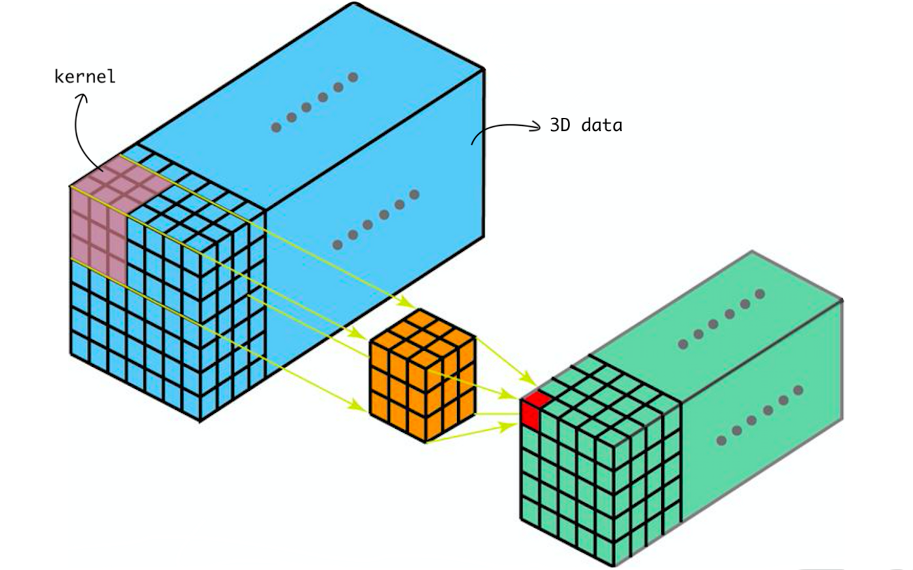

# Motivation
Reconstructing the 3D structure of an object from one or more images is not only interesting for 3D modeling, robotics, or animation, but also for medical diagnosis. When doctors know the 3D structure of a bone, they can choose the most appropriate implant and plan the surgery based on that information. Moreover they are able to even create a patient-specific implant or jigs (OP templates) adapted specifically to the bone. The 3D structure of a bone can be reconstructed with a computed tomography (CT) scan, yet this involves a much higher radiation exposure. It would therefore be very advantageous for the patient if one or more X-ray images were sufficient instead of a CT scan. A method for 3D reconstruction of the bones in the knee using two perpendicular X-ray images has been proposed by **[End-To-End Convolutional Neural Network for 3D Reconstruction of Knee Bones From Bi-Planar X-Ray Images, Kasten et al., 2020](https://arxiv.org/pdf/2004.00871.pdf)**. If you want to understand how this approach works, this blog post explains the method and results of the paper.

## X-Ray and CT
For better understanding, let's start with some information about X-rays and CT. To take an X-ray image, X-rays are sent through the object of interest and recorded on a film (on the detector) placed behind. Different tissues transmit different amounts of radiation. For example, the X-ray image is dark gray when it passes through water, while it is light gray for bones because little radiation passes through. On the X-ray image, bones, therefore, stand out clearly from the soft tissues (muscles, cartilage, etc.) surrounding them (see [figure 1](#fig:knee_ap_lat_1)).

<figure id="fig:knee_ap_lat">
  
  
  
  <figcaption>
  
  [a](https://www.researchgate.net/figure/AP-and-lateral-X-ray-views-of-the-right-unaffected-knee_fig2_285656875)

  </figcaption>

</figure>

<a id="fig:knee_ap_lat_1">

{:.image-caption}
*of a knee joint. Source:  [a](https://www.researchgate.net/figure/AP-and-lateral-X-ray-views-of-the-right-unaffected-knee_fig2_285656875)*

In contrast to an X-ray, where only one image is taken, a CT involves taking multiple X-ray images through a rotating X-ray tube. The different images, taken from different angles, are then postprocessed to create a slice image (tomographic image). Thus we can imagine to have an X-ray-like image of every slice. So, as shown in the [figure 2](#fig:knee_ct), a CT scan can be used to obtain slices of the bone.

<figure id="fig:knee_ct">
  
  <figcaption>Figure 2: CT views and 3D model of a knee joint with a tibial fracture.  Source: Based on <a href="https://www.semanticscholar.org/paper/Role-of-3-D-CT-in-Evaluation-of-Tibial-Plateau-Manjula-Venkataratnam/04a66d5da8fdaea3d591ee7192c70358875498d7/figure/1" 
  ­target="_blank"­>[2]</a></figcaption>
</figure>

For this reason, X-ray is not only cheaper and more widely available but the patient is also exposed to less ionizing radiation, which reduces the implied cancer risk compared to CT. For example, a chest X-ray exposes the patient to only 0.1 mSv, compared to 7 mSv for CT ([source](https://www.health.harvard.edu/cancer/radiation-risk-from-medical-imaging)). For comparison, in Germany, the average natural radiation exposure is 2.1 mSv per year and the limit for radiation protection personnel is 20 mSv per year ([source](https://www.admnucleartechnologies.com.au/blog/what-safe-level-radiation-exposure)). A CT scan should therefore only be performed if there is a clear medical indication and, if possible, an X-ray should be preferred.

# Method
## Input and Output
As a reminder, the goal of the paper is to reconstruct the 3D structure of bones from two perpendicular X-ray images. This is shown in [figure 3](#fig:input_output): The two X-ray images in the background are the input and the 3D models of the bones (colored 3D structures) are the desired output. One X-ray is taken from the front (AP), i.e. with the back to the detector, and one from the side (lateral), i.e. with the body side to the detector. The resulting AP and lateral knee X-ray images are shown in [figure 1](#fig:knee_ap_lat). 

<figure id="fig:input_output">
  
  <figcaption>Figure 3: Input X-rays in the background and desired output 3D reconstruction of the bones. Source: <a href="https://www.prnewswire.com/news-releases/rsip-vision-announces-breakthrough-ai-technology-for-3d-reconstruction-of-knees-from-x-ray-images-301024885.html" 
  ­target="_blank"­>[3]</a></figcaption>
</figure>

A two-channel volume representation is now created from the X-ray images. Both images are scaled to the size 128 x 128 px and then stacked 128 times on top of each other. In the resulting volume with the dimensions 128 x 128 x 128, each voxel (designation for a "3D pixel") accordingly has two channels: 1) the corresponding gray value of the AP X-ray image and 2) that of the lateral image. You can think of the channels as in a color image: Each pixel has three channels, the RGB values. In our case, each voxel has only two channels, the two gray values. This two-channel volume will be the input for the algorithm. 

The goal is to perform a semantic 3D segmentation of the volume, i.e. predicting the class of each voxel. For example, a voxel can be a part of the femur, another bone, or the soft tissues, skin, or air surrounding them. The input and output can be seen in [figure 4](#fig:input_output): On the left side is the output volume and on the right side is the predicted segmentation map that assigns a label to each voxel. In the case of the knee, we have five classes: Femur (red), Tibia (blue), Patella (green), Fibula (yellow), and a "none of them" class called Background. 

<figure id="fig:input_output">
  
  <figcaption>Figure 4: Input volume constructed of two X-ray images and output 3D segmentation map. Source: Based on <a href="https://arxiv.org/pdf/2004.00871.pdf" 
  ­target="_blank"­>[4]</a></figcaption>
</figure>

## Architecture
As you just saw in [figure 4](#fig:input_output), a convolutional neural network (CNN) is used for 3D segmentation. If you already know about CNNs, you can skip the next section and go directly to the network architecture. Otherwise, the following section will give you some background knowledge.

### CNN
A convolutional neural network (CNN) is a neural network that uses convolutional layers. In general, a neural network consists of neurons organized into layers, and each neuron has a learnable bias and weight. If you want to know more about neural networks, I recommend [this blog post](https://ujjwalkarn.me/2016/08/09/quick-intro-neural-networks/). 

The most important parts of a CNN are the so-called convolutional layers. Let's take a look at what a convolutional layer does: Its goal is to extract features from the input, such as detecting edges. To do this, it uses a small square called the kernel, that contains multiple weights. For convolution, the image is multiplied by the kernel (element-wise dot product) to compute the convolved feature, also called "feature map". A visualization of convolution can be seen in [figure 5](#fig:convolution). As the kernel (in yellow) moves over the image, the pixels underneath are added with the weights (small red multipliers) and the sum is entered into the feature map. The kernel moves once over all pixels and its weights of the kernel are learned during training by the CNN.

<figure id="fig:convolution">
  
  <figcaption>Figure 5: Convolution of a 5x5 image with a 3x3 kernel to get a 3x3 feature map (no padding or stride). Source: <a href="https://towardsdatascience.com/a-comprehensive-guide-to-convolutional-neural-networks-the-eli5-way-3bd2b1164a53" 
  ­target="_blank"­>[5]</a></figcaption>
</figure>

In order to be able to convolve the outer pixels as well, additional pixels can be inserted around the image. This is called padding and is shown as a white pixel in [figure 6](#fig:stride). Also, we don't need to apply the kernel to every pixel, but only to every second pixel, for example. This is called the stride and describes the number of pixels we move in the input matrix. A higher stride results in a smaller feature map, as we see in [figure 6](#fig:stride). Because of the stride of two, one pixel is always skipped there.

<figure id="fig:stride">
  
  <figcaption>Figure 6: Convolution with padding (white pixel) and a stride of length two. Source: <a href="https://towardsdatascience.com/a-comprehensive-guide-to-convolutional-neural-networks-the-eli5-way-3bd2b1164a53" 
  ­target="_blank"­>[5]</a></figcaption>
</figure>

After each convolution, we apply the so-called activation function. This is a function that generates nonlinear decision boundaries and therefore allows the output to be written as a linear combination of the inputs. A common activation function is the Rectified Linear Unit (ReLU) function, which returns zero for negative inputs and the value of the input for positive inputs. A variation of this function is the LeakyReLU, where instead of setting the negative values to zero, we multiply them by a small number, e.g., 0.02. Taking this one step further, we do not fix the small value we're multiplying by, but learn it during training. This is called PRelu and allows for better fitting to other parameters. All the functions are shown in the [figure 7](#fig:relu), and if you want to learn more about it, I recommend [this blog post](https://medium.com/@shauryagoel/prelu-activation-e294bb21fefa). 

<figure id="fig:relu">
  
  <figcaption>Figure 7: Activation functions: ReLU (left), LeakyReLU (middle) and PReLU (right). Source: <a href="https://medium.com/@shauryagoel/prelu-activation-e294bb21fefa" 
  ­target="_blank"­>[6]</a></figcaption>
</figure>

Another important component of CNN are the pooling layers. Their purpose is to reduce the parameters of the image and thus the overall computation of the network. A common pooling technique is max-pooling, which is visualized in [figure 8](#fig:maxpool). Again, we use a square, but instead of computing the weighted sum, we take the largest element. Thus, we can reduce the resolution and remember only the most important element. I don't want to get into that any further, but if you want to learn more about CNNs, pooling techniques, etc., I recommend the following blog posts, which I have also used as resources ([here](https://poloclub.github.io/cnn-explainer/), [here](https://medium.com/@RaghavPrabhu/understanding-of-convolutional-neural-network-cnn-deep-learning-99760835f148), [here](https://ujjwalkarn.me/2016/08/11/intuitive-explanation-convnets/))

<figure id="fig:maxpool">
  
  <figcaption>Figure 8: Max pooling with stride 2 and a 2x2 filter. Source: <a href="https://medium.com/@RaghavPrabhu/understanding-of-convolutional-neural-network-cnn-deep-learning-99760835f148" 
  ­target="_blank"­>[7]</a></figcaption>
</figure>

### Network Architecture
The architecture of the network is inspired by the [V-Net](https://campar.in.tum.de/pub/milletari2016Vnet/milletari2016Vnet.pdf). We will therefore first take a look at the V-Net and how it performs volumetric convolution before looking at how it differs from the mesh used. A visualization of the architecture of the V-Net can be seen in [figure 9](#fig:vnet). The left part of the network compresses the data, while the right part decompresses the data to its original size. In this sense, it is similar to the [U-net](https://arxiv.org/pdf/1505.04597.pdf), which is popular for segmenting medical images. 

<figure id="fig:vnet">
  
  <figcaption>Figure 9: V-Net architecture. Source: <a href="https://campar.in.tum.de/pub/milletari2016Vnet/milletari2016Vnet.pdf" 
  ­target="_blank"­>[8]</a></figcaption>
</figure>

Let's first take a look at the left part of the model. We start with a single-channel volume and perform a convolution using a 5x5x5 kernel with appropriate padding. A 3D convolution works similarly to a 2D convolution, except that we have a 3D input and a 3D kernel, as you can see in [figure 10](#fig:kernel_3d). Therefore, the kernel moves in all three dimensions, not just two. Instead of using only one kernel to obtain one feature map, 16 different kernels are used to obtain 16 distinct feature maps, resulting in a volume with 16 channels. Subsequent stages contain one to three convolutional layers with PReLu as activation function, doubling the number of channels in each stage. At the end of each stage, the resolution is reduced. Instead of making use of pooling, a convolutional layer is used again. This convolutional layer uses a 2x2x2 kernel and a stride of 2, so the resulting feature maps' size is halved. To get a notion, you can think of the resulting effect as extracting "what" is in the image rather than "where" it is.

<figure id="fig:kernel_3d">
  
  <figcaption>Figure 10: Convolution of a 3D volume with 3D kernel. Source: <a href="https://towardsdatascience.com/understanding-1d-and-3d-convolution-neural-network-keras-9d8f76e29610" 
  ­target="_blank"­>[9]</a></figcaption>
</figure>

You may have noticed that the input is not only used for the convolutional layers, but is also added to the output of the last convolutional layer of the stage. The goal of this architecture is for each stage to learn a residual function. Thus, it is not the output that is learned, but what is missing from the input (residual). It has been shown that this architecture is much faster. If you want to learn more about residual blocks and the mathematical background, read the [paper](https://arxiv.org/pdf/1512.03385.pdf) or [this blog post](https://towardsdatascience.com/residual-blocks-building-blocks-of-resnet-fd90ca15d6ec).

The goal of the right part of the model is to project the extracted features back onto the pixel space. Instead of scaling the input down, we now scale it up and learn where the features are located. So the further up we go, the higher the resolution and the lower the number of channels. For upsampling, deconvolution is performed at the end of each stage. The process is illustrated in [figure 11](#fig:deconv): the resolution is increased by projecting each input voxel to a larger region by the kernel. In our model we also see that residual functions continue to be learned and the number of channels is halved at each stage. 

<figure id="fig:deconv">
  
  <figcaption>Figure 11: Convolution and Deconvolution of a 3D volume. Source: <a href="https://campar.in.tum.de/pub/milletari2016Vnet/milletari2016Vnet.pdf" 
  ­target="_blank"­>[8]</a></figcaption>
</figure>

One thing is still missing: The horizontal connections. These forward the extracted features of the left part to the right part, by concatenating the input and the feature maps of the corresponding stage on the right side. Thus, location information and fine details are collected that would otherwise be lost during compression. In this way, the quality of the final prediction, especially on the contours, is improved and a faster convergence time is achieved.

Looking at the V-Net, the last step is to perform a convolution with a 1x1x1 filter and apply the softmax function voxel-wise. The softmax function normalizes the output so that it can be interpreted as class probabilities. By selecting the class with the highest probability, a 3D semantic segmentation of the volume is archived.

The architecture of the network in the paper deviates slightly from that of the V-Net and is shown in (#fig:architecture). First of all, for the convolution a 3x3x3 kernel (instead of 5x5x5) is used. The number of channels is also different, both in the input and in the stages. Also, instead of convolution, max-pooling is used for downsampling. The five output channels represent the five output classes (four bone types and background).

<figure id="fig:architecture">
  
  <figcaption>Figure 12: Architecture of the presented network. Source: <a href="https://arxiv.org/pdf/2004.00871.pdf" 
  ­target="_blank"­>[4]</a></figcaption>
</figure>

## Training
X-ray images with associated 3D ground truth segmentation are required for training. Since pairs of X-ray images and CT reconstructions are rare and geometric alignment is non-trivial, synthetic X-ray images are used instead. These digitally reconstructed radiographs (DRR) are created by casting rays through a volume. During the ray trajectory, the attenuation coefficients of the voxels are integrated and projected onto the image plane. The basic idea is shown in [figure 13](#fig:drr). Thus, a corresponding X-ray image can be generated from a labeled CT scan. 

<figure id="fig:drr">
  
  <figcaption>Figure 13: Generation of a DRR with a CT volume. Source: <a href="https://www.researchgate.net/journal/BioMedical-Engineering-OnLine-1475-925X/publication/305923045_Validity_and_reliability_of_ankle_morphological_measurements_on_computerized_tomography-synthesized_planar_radiographs/links/5fc3aeb5458515b79784f80f/Validity-and-reliability-of-ankle-morphological-measurements-on-computerized-tomography-synthesized-planar-radiographs.pdf" 
  ­target="_blank"­>[10]</a></figcaption>
</figure>

The data is used for the supervised loss function: A spatially weighted cross-entropy loss. The voxels on the surface receive a higher weight than the voxels inside the bone. To understand why this makes sense, just imagine a stick that is similar in size to the femur. They have perhaps 90% of the volume in common, and so the stick, therefore, gives a fairly good result, although it does not capture the actual features of the bone at all. For this reason, we pay special attention to the surface that is hard to capture. We can see a visualization of the weighting in the following [figure 14](#fig:weightmap). If you want to learn aber cross-entropy loss I recommend you this [blog post](https://towardsdatascience.com/cross-entropy-loss-function-f38c4ec8643e).

<figure id="fig:weightmap">
  
  <figcaption>Figure 14: Visualization fo the weightmap used for the weighted cross-entropy loss. Source: <a href="https://arxiv.org/pdf/2004.00871.pdf" 
  ­target="_blank"­>[4]</a></figcaption>
</figure>

In addition, an unsupervised loss is used to improve alignment with the X-ray images. This requires the gradients of the input X-ray images and the DRRs. The gradient is the directional derivative of an image and shows the change in intensity. To get an idea of the gradients and because everyone likes cats, [figure 15](#fig:gradient) shows an image of a cat along with its gradient images in x and y directions. The black or white areas indicate positive or negative values, while the gray areas are close to zero. Note that the gradient is particularly strong, at the border between the white blanket and the black background, for example. And just for your information: A gradient image can also be calculated using convolution. 

<figure id="fig:gradient">
  
  <figcaption> Figure 15: Original cat image (left) with x-gradient (middle) and y-gradient (right). Source: <a href="https://en.wikipedia.org/wiki/Image_gradient" 
  ­target="_blank"­>[11]</a></figcaption>
</figure>

In the context of the paper, it is assumed that the gradients of the bones are quite dominant, compared to the ones of the tissues. Therefore, the gradients of the input and artificial radiographs should be relatively correlated. Thus, they enforce a high normalized gradient cross-correlation for both radiograph pairs (lateral and AP). Intuitively, this means that the reconstructed bones seen on the artificial X-rays should have the same outline as the bones on the real X-rays. This leads to better generalization, even for images that the model has not seen before. The final loss is the sum of the spatially weighted cross entropy and the normalized gradient cross-correlation of the real and artificial X-ray images. 

You may have wondered whether real and artificial X-ray images really look the same and whether this poses a problem. And yes, they do look different, as you can see in [figure 16](#fig:drr_xray) and this may cause problems. To solve this problem, the authors trained a style transfer model based on CycleGAN. This model takes the X-ray image and transforms it to look like DRR, making it familiar to the CNN. For more technical details or the loss formulas, I recommend you to take a look at the paper. 

<figure id="fig:drr_xray">
  
  <figcaption> Figure 16: Original X-ray images on the right side and generated DRRs on the left side. Source: <a href="https://arxiv.org/pdf/2004.00871.pdf" 
  ­target="_blank"­>[4]</a></figcaption>
</figure>

# Evaluation & Results

To understand the evaluation, we first take a look at the metrics, the approaches against which the result is compared, and the test data used. This gives us the necessary context to understand the evaluation results. 

## Metrics
Two metrics are used to evaluate the data: the Chamfer distance in mm and the Dice coefficient. The chamfer distance describes the average distance to the nearest feature in the ground truth. Therefore, the smaller the Chamfer distance the better. 

The dice coefficient is calculated for each class on the voxels by dividing two times the overlap of the voxels by the number of class voxels in the prediction and the ground truth (see [figure 17](#fig:dice)). So a perfect prediction would give 1, and we can say the higher the Dice coefficient, the better. 
<figure id="fig:dice">
  
  <figcaption> Figure 17: Illustration of dice coefficient: 2 * X ∩ Y / (|X| + |Y|). Source: <a href="https://towardsdatascience.com/metrics-to-evaluate-your-semantic-segmentation-model-6bcb99639aa2" 
  ­target="_blank"­>[12]</a></figcaption>
</figure>

## Statistical Shape Models
The paper's authers compare their results to other methods: one based on statistical shape models (SSM) and another approach also based on a CNN. Before Deep Learning was used for 3D bone reconstruction, SSM or statistical shape and intensity models (SSIM) were the most popular method. The idea is that given enough examples, we know what the average bone looks like. And similar to creating phantom images, variations are tried until the structure of the bone in question is mapped as accurately as possible. Just as the shape of the eyes can be varied when creating a phantom image, for example, the size of the femur, or the angle of the head to the shaft can be varied (see [figure 18](#fig:ssm_femur)). A disadvantage of the method is that it depends heavily on the initialization and also takes quite a lot of time.

<figure id="fig:ssm_femur">
  
  <figcaption> Figure 18: Variations of the femur shape model used in SSM models. Source: <a href="https://biomedical-engineering-online.biomedcentral.com/track/pdf/10.1186/s12938-017-0340-0.pdf" 
  ­target="_blank"­>[13]</a></figcaption>
</figure>

## Test data
The evaluation is performed a) with CT scans and DRRs, as well as b) with real X-ray images. 

### DRR test results
The DRRs are created using a test set of 20 CT scans. The DRR pairs are used as input and the CT scans as ground truth. The Marching Cubes algorithm is used to create a set of 3D bone meshes from the segmentation map. The metrics are calculated using the reconstructions (not the segmentation map). The results are shown in the table. As we can see, the average distance to the bones is about 1.3 mm and we have an average Dice score of 0.9. 

|              |   | Background | Femur | Patella | Tibia | Fibula | Bones average |  
|--------------|---|------------|-------|---------|-------|--------|---------------|
| **Chamfer (mm)** |   | -          | 1.075 | 1.709   | 1.175 | 1.218  | 1.294     |
| **Dice**         |   | 0.986      | 0.943 | 0.894   | 0.945 | 0.848  | 0.907     | 

### Real X-rays test results. 
The real-world data set consisted of 28 pairs of X-rays. Since no 3D ground truth data was available, they had experts segment the X-ray images. They then projected the 3D model onto the X-ray images and compared the edges to the ground truth masks. So this time the Chamfer distance does not refer to the 3D distance, but to the 2D distance on the X-ray image. 

For the SSIM model from [Gp-gpu accelerated intensity-based 2d/3d registration pipeline. In: Proceedings of Shape Symposium. Klima, et al., 2015](https://www.fit.vut.cz/research/publication-file/10928/GP-GPU_ACCELERATED_INTENSITY-BASED_2D-3D_REGISTRATION_PIPELINE.pdf), only the code for the femur was available. A manual initialization was performed (see in the table "manual"). Some random perturbations were applied later to the initialization to test the sensitivity of the model (see table "perturbed"). The perturbation impacted the performance, the convergence rate (34% did not converge at all), and the convergence time. 

The results are also compared with [Using Bi-planar X-Ray Images to Reconstruct the Spine Structure by the Convolution Neural Network, Chen, et al. 2020](https://www.springerprofessional.de/en/using-bi-planar-x-ray-images-to-reconstruct-the-spine-structure-/17218070). The approach uses 2D convolutional layers to extract a feature vector and then decodes it with 3D convolutional layers for 3D reconstruction. It was originally developed and tested for simulated X-ray images of a single vertebra.  

As we can see in the table, the presented approach achieved a higher Dice and a smaller 2D Chamfer distance. Moreover, no initialization was required and it converged faster than the SSIM model (no time was given for the other CNN approach). The same data was used to evaluate all three approaches.

 |              |   | Femur SSIM |           | Chen et al, 2020 | Result of the paper |         |        |        |            |
|--------------|---|------------|-----------|--------------|-----------------|---------|--------|--------|------------|
|              |   | **Manual**     | **Perturbed** | **Femur**        | **Femur**           | **Patella** | **Tibia**  | **Fibula** | **Bones avg.** |
| **Chamfer (mm)** |   | 7.529      | 8.559     | 3.984        | 1.691           | 1.198   | 1.135  | 2.873  | 1.778      |
| **Dice**         |   | 0.803      | 0.783     | 0.878        | 0.948           | 0.91    | 0.959  | 0.809  | 0.906      |
|                      |   |            |           |              |                 |         |        |        |            |
| **Convergence time (s)** |   | 4.88       | 6.05      | -            | 0.5             |         |        |        |            |

# Discussion
The presented paper has shown a method for 3D reconstruction of bones using 2D X-ray images. However, 3D shape reconstruction is not limited to the medical field. Major breakthroughs in 3D objection reconstruction of single or multiple images have been achieved by [Pix2Vox](https://arxiv.org/pdf/1901.11153v2.pdf) and [Pix2Vox++](https://arxiv.org/pdf/2006.12250v2.pdf). If you are more interested, I recommend you to read the papers or get your hands dirty and have a look at the official [repository](https://github.com/hzxie/Pix2Vox). 

One aspect that I particularly like about the approach presented is that the method is based on only two X-ray images, which are also taken in everyday clinical practice. This ensures that it is easy to integrate. I think this can not only help doctors in surgery planning, but in combination with other methods such as 2D-3D registration, it can also be used to measure other parameters such as implant migration.  

One problem I noticed while doing research for this blog post, which is common especially in the context of medical data, is the lack of common data sets and metrics. This makes it difficult to compare results from different approaches. A consistent standard of which metric is used and shared datasets would be helpful here and would allow benchmarks.

Lastly, I would like to point out a great paper that also reconstructed the 3D structure of bones using X-ray images: [2D-3D reconstruction of distal forearm bone from actual X-ray images of the wrist using convolutional neural networks, Shiode et al., 2021](https://www.nature.com/articles/s41598-021-94634-2.pdf). The special thing is that the reconstructed bones are the bones of the hand wrist, which are very small (especially compared to the bones in the knee). This approach is also based on CNNs and achieved accuracies of 1.05 mm. If you are now wondering how many bones you would have to reconstruct if you wanted the 3D bone structure of all your bones, the answer is circa 206. 

# Image References
[1] Chiu et al. "Isolated Proximal Tibiofibular Dislocation during Soccer." Case Reports in Emergency Medicine 2015(6):1-3 (2015). https://www.researchgate.net/publication/285656875_Isolated_Proximal_Tibiofibular_Dislocation_during_Soccer

[2] Manjula et al. “Role of 3 D CT in Evaluation of Tibial Plateau Fractures.” (2015). https://www.semanticscholar.org/paper/Role-of-3-D-CT-in-Evaluation-of-Tibial-Plateau-Manjula-Venkataratnam/04a66d5da8fdaea3d591ee7192c70358875498d7/figure/1

[3] "RSIP Vision Announces Breakthrough AI technology for 3D Reconstruction of Knees from X-ray Images." (2020). https://www.prnewswire.com/news-releases/rsip-vision-announces-breakthrough-ai-technology-for-3d-reconstruction-of-knees-from-x-ray-images-301024885.html

[4] Kasten et al. "End-to-end convolutional neural network for 3D reconstruction of knee bones from bi-planar X-ray images." International Workshop on Machine Learning for Medical Image Reconstruction. Springer, Cham (2020). https://arxiv.org/pdf/2004.00871.pdf

[5] Saha. "A Comprehensive Guide to Convolutional Neural Networks — the ELI5 way." (2018). https://towardsdatascience.com/a-comprehensive-guide-to-convolutional-neural-networks-the-eli5-way-3bd2b1164a53

[6] Goel. "PReLU activation." (2019). https://medium.com/@shauryagoel/prelu-activation-e294bb21fefa

[7] Prabhu. "Understanding of Convolutional Neural Network (CNN) — Deep Learning." (2018). https://medium.com/@RaghavPrabhu/understanding-of-convolutional-neural-network-cnn-deep-learning-99760835f148

[8] Milletari et al. "V-net: Fully convolutional neural networks for volumetric medical image segmentation." 2016 fourth international conference on 3D vision (3DV). IEEE (2016). https://campar.in.tum.de/pub/milletari2016Vnet/milletari2016Vnet.pdf

[9] Verma. "Understanding 1D and 3D Convolution Neural Network | Keras." (2019). https://towardsdatascience.com/understanding-1d-and-3d-convolution-neural-network-keras-9d8f76e29610

[10] Kuo et al. "Validity and reliability of ankle morphological measurements on computerized tomography-synthesized planar radiographs." BioMedical Engineering OnLine 15.1 (2016). https://pubmed.ncbi.nlm.nih.gov/27495933/

[11] "Image gradient". https://en.wikipedia.org/wiki/Image_gradient

[12] Tiu. "Metrics to Evaluate your Semantic Segmentation Model." (2019). https://towardsdatascience.com/metrics-to-evaluate-your-semantic-segmentation-model-6bcb99639aa2

[13] Wang et al. "Automatic construction of statistical shape models using deformable simplex meshes with vector field convolution energy." Biomedical engineering online 16.1 (2017). https://biomedical-engineering-online.biomedcentral.com/track/pdf/10.1186/s12938-017-0340-0.pdf